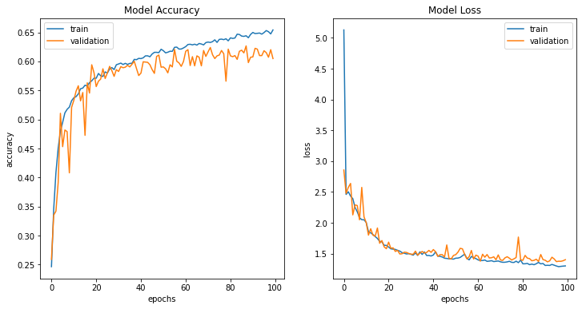

# Facial Emotion Recognition

The goal of this project is to classify images of human faces into one of seven basic emotions. To do so, I used **Convolutional Neural Networks** as the advantage it had over its precedessors is that it can automatically detect important features without human intervention. CNNs are computationally efficient as well due to the special convolution and pooling operations.

## The Model:

The model used for this project is shown below. It consists of an input layer, three hidden layers, a flatten layer and finally an output layer.

## The Dataset:

The dataset used for this project was the FER-2013 dataset. It consists of 35,887 images, each of size 48x48 pixels. This data was split into 28,709 images (training) and 7,178 images (testing).

## Training and Testing:

The model was trained for 5, 10, 20, 30, 40, 50, and 100 epochs with a batch size of 64. For each training cycle, a graph of validation and training accuracy as well as validation and training loss was plotted. In the end, the model produced an accuracy of 60.5% on testing for 100 epochs.

